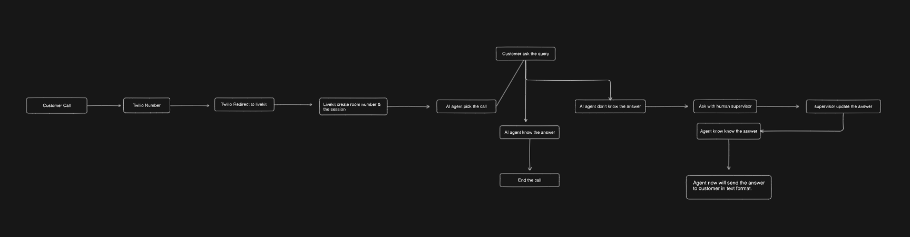
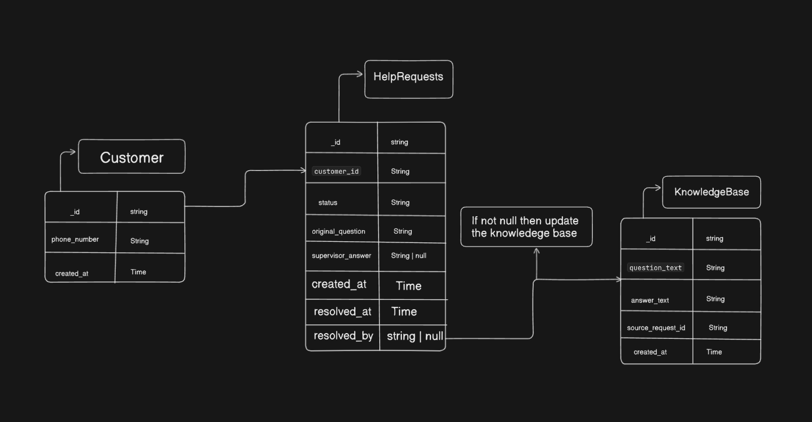

# Overview
Human-in-the-Loop AI Supervisor
This project implements a modular, self-improving AI system designed to intelligently escalate customer queries that the AI agent cannot answer. The system then captures the human supervisor's answer, uses it to follow up with the original customer via SMS, and permanently updates its knowledge base.

This system is built on a Service-Oriented Architecture (SOA), split into two decoupled Node.js applications and one MongoDB database.

# 🧠 System Architecture And Tables

Here’s a high-level view of how the Human-in-the-Loop AI Supervisor works:



Here’s a tables of the Human-in-the-Loop AI Supervisor:



# 1.2 Installation Steps
## A. Clone and Install Repositories

### Clone the LiveKit Agent Starter And Backend-Services repo
```
git clone https://github.com/Irshad-Ahmaed/H-I-T-L-Frontdesk.git backend-services

git clone -b ai-agent https://github.com/Irshad-Ahmaed/H-I-T-L-Frontdesk.git ai-agent
```

### Navigate to the backend and install
```
cd backend-services
npm install
```

### Navigate to the agent and install
```
cd ai-agent
pnpm install
```

## B. Configure Environment Variables
- You will find necessary .env keys in .env.example file

# 1.3 Setup Twilio
- Setup twilio SIP Truck
- Add livekit SIP to Organization in twilio(Elastic SIP Truck section)

# 1.4 Setup Livekit
- Setup Livekit project
- create Truck and connect twilio number init
- create dispatch rule

# 1.5 Running the System
- In /backend-services: npm run dev
- In /ai-agent: pnpm run dev

## Final Step
Call the twilio number and it will get you connect with your AI agent